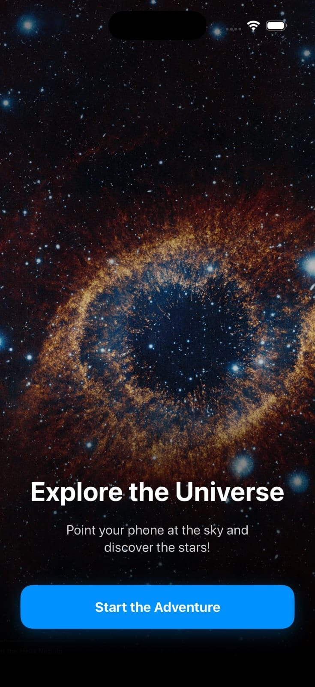

<p align="center">
  
</p>


---

# Mini Sky Explorer

**Explore the sky through AR and immersive 360° visuals.**
Mini Sky Explorer is an iOS application built with **SwiftUI, ARKit, and RealityKit**.
Point your device at the sky to visualize stars, planets, and celestial bodies, or switch to an immersive 360° galaxy panorama to explore the universe from anywhere.

---

## 📸 Screenshots

| Onboarding                                               | AR Camera Mode                                   | Galaxy Panorama Mode                                 |                                 
| -------------------------------------------------------- | ------------------------------------------------ | ---------------------------------------------------- |
|     |  |  |

---

## Features

### Augmented Reality (AR) Features

* Leverages ARKit world tracking to render stars in precise 3D positions relative to the user.
* Uses device gravity and compass alignment to synchronize the AR scene with the user’s real-world direction.
* Displays 3D glowing stars with floating, camera-facing labels.
  
### 360° Galaxy Mode

* A Panoramic spherical environment can replace the camera feed.
* Unlit, immersive rendering for maximum clarity.
* Ideal for indoor usage or demonstrations.

### 🪐 Celestial Objects

* Includes planets and stars.
* Each object has a precise 3D position and a floating, billboarded label.

### Simple UI / UX

* Elegant onboarding screen for first-time users.
* One-tap toggle between Camera View and Galaxy View.
* Enforced dark mode for visual consistency.

### Technical Highlights
* Native SwiftUI, RealityKit and ARKit architecture.
* CoreMotion integration for device orientation and motion tracking.
* Lightweight, no third-party dependencies.

---

## 🛠 Installation

1. Clone the repository:

   ```bash
   https://github.com/micheladauria/MiniSkyExplorer.git
   ```
2. Open the project in **Xcode 15+**.
3. Connect a physical ARKit-compatible device.
4. Build and run.

---

## 📁 Project Structure

```
MiniSkyExplorer/
│
├── OnboardingView.swift         # Intro screen
├── RootView.swift               # Navigation and AppStorage logic
│
├── MiniSkyExplorerApp.swift     # App entry point
├── ContentView.swift            # Main AR view + mode toggle
│
├── ARViewContainer.swift        # ARView scenes
├── StarManager.swift            # Celestial objects data model
├── MotionManager.swift          # Device motion management
│
├── StarEntityModel.swift        # 3D star sphere generator
├── StarLabelModel.swift         # Billboard text label generator
│
└── Assets/                      # App icon and images
```

---

## Inspiration

Inspired by App Store astronomy apps:

* **Sky Guide**
* **Star Walk**
* **Night Sky**

Key lessons:

* Minimal UI improves clarity
* Billboard labels enhance readability
* Simple interactions work best in AR
* Dark backgrounds support star visibility

Mini Sky Explorer recreates the core feature of these apps:

> **Displaying stars in real 3D space.**

---

## What I Learned

### Technical Skills

* SwiftUI + RealityKit integration
* 3D mesh and material creation
* World tracking and device orientation
* App analysis and deconstruction.
* MVVM-style app structure using ObservableObjects.
* GitHub repo organization and documentation.

### Personal Skills

* Improved self-learning and independent research.
* Iteration through prototypes.
* Better documentation and communication.

---

## 🛣 Future Improvements

* [ ] Real astronomical catalog data.
* [ ] Tap-to-select stars with info popups.
* [ ] Improved real-sky alignment.
* [ ] Draw constellation lines.
* [ ] Dark mode optimized colors.

---

## Technologies Used

* **SwiftUI**
* **ARKit**
* **RealityKit**
* **CoreMotion**
* **Combine**
* **simd**

---

## 📄 License

This project is licensed under the **MIT License**.
See the `LICENSE` file for details.

---

# 📚 Technical Documentation

## 1. Overview

Mini Sky Explorer is a small but functional AR based astronomy app that displays stars and planets in 3D positions relative to the user.

---

## 2. System Architecture

### 2.1 High-Level Diagram

```
SwiftUI
 ├── ContentView
 │     └── ARViewContainer
 ├── OnboardingView / RootView
 └── ObservableObjects
        ├── StarManager
        └── MotionManager
```

```
RealityKit
 ├── ARView
 ├── Stars Anchor
 │     ├── StarEntityModel
 │     └── StarLabelModel
 └── Environment (camera / panorama)
```

```
ARKit
 ├── WorldTrackingConfiguration
 ├── Gravity + Heading alignment
 ├── Camera feed
 └── Session handling
```

---

## 3. Core Components

### 3.1 ARViewContainer

* Bridges SwiftUI and RealityKit.
* Recreates the scene when switching modes.
* Initializes star objects into an anchor.

### 3.2 StarManager

Stores celestial objects data:

```swift
struct Star {
    let id = UUID()
    let name: String
    let position: SIMD3<Float>
}
```

### 3.3 MotionManager

Tracks device orientation via CoreMotion.
(Useful for future alignment improvements)

### 3.4 StarEntityModel

Creates 3D spheres:

```swift
ModelEntity(mesh: .generateSphere(radius: 0.03))
```

### 3.5 StarLabelModel

* Generates text labels
`MeshResource.generateText`
* Uses unlit material for readability.
* BillboardComponent ensures labels always face the camera.

---

## 4. AR Implementation Details

### 4.1 World Alignment

```swift
config.worldAlignment = .gravityAndHeading
```
Aligns virtual objects to gravity (vertical axis) and compass heading (north).

### 4.2 Panorama Sphere

```swift
panoramaSphere.scale = SIMD3(repeating: -1)
```
Inverts the sphere for proper 360° viewing.

---

## 5. UI / UX Flow

Start → Onboarding → Main View

* Smooth transitions.
* Dark mode enforced.
* A single button toggles between modes.

---

## 6. Dependencies

Native frameworks only:
* ARKit
* RealityKit
* SwiftUI
* Combine
* CoreMotion

---

## 7. Requirements

* iOS 17+
* Xcode 15+
* ARKit-compatible iPhone

---

## 8. Conclusion

Mini Sky Explorer reproduces a core AR astronomy feature using native Apple frameworks.
It demonstrates strong AR foundations, immersive UI, and aligns with Challenge 2 learning objectives.
